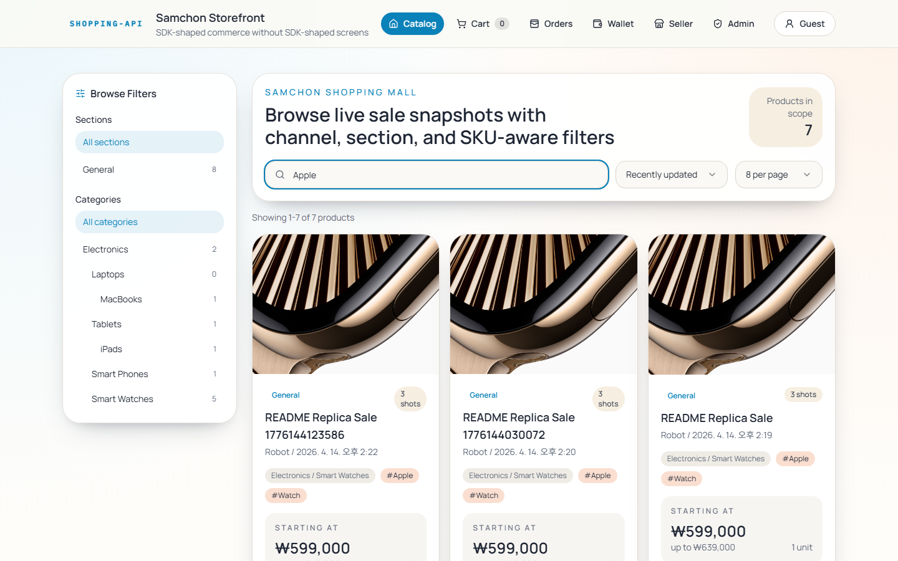
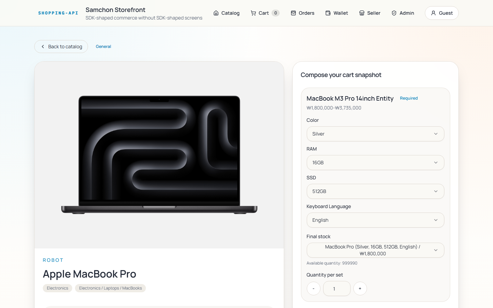
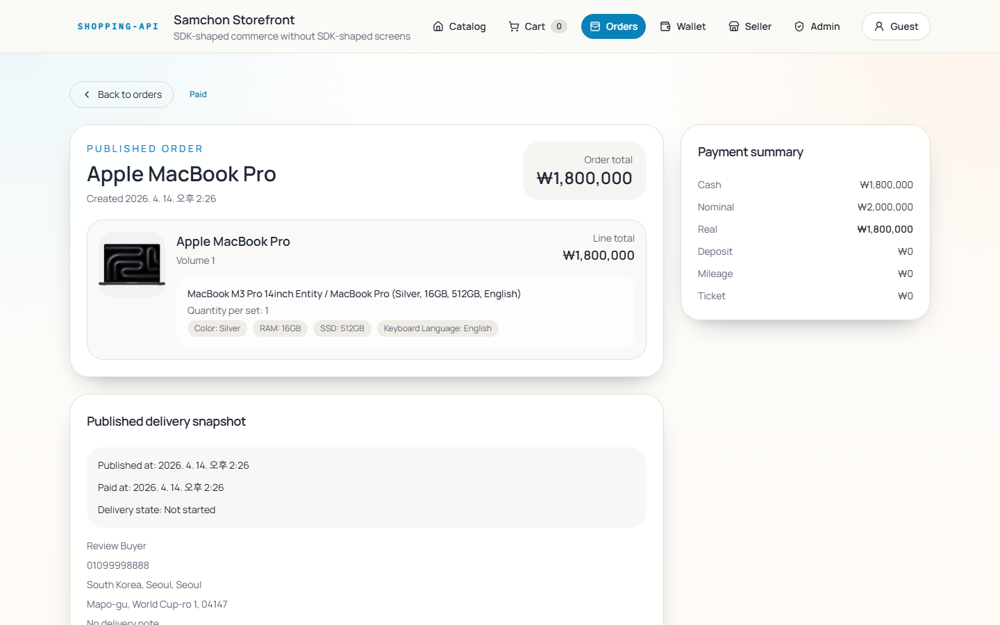
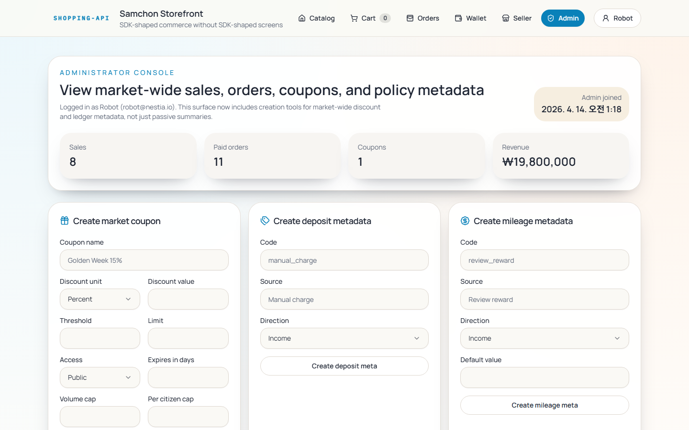

# Shopping Mall Monorepo

[](https://github.com/samchon/shopping/blob/master/LICENSE)
[](https://www.npmjs.com/package/@samchon/shopping-api)
[](https://github.com/samchon/shopping/actions/workflows/build.yml)

## 1. Prologue
Well-designed backend + Nestia-generated SDK = AI fully automates the frontend.

A human wrote the backend. Nestia generated a typed SDK. AI (Claude Code) read the SDK and a single [`CLAUDE.md`](packages/frontend/CLAUDE.md), then built every page, component, and test by itself. This repo is the proof.

With AutoBe, you don't even need to write the backend.

- [Nestia](https://nestia.io): SDK generator for NestJS
- [Nestia Editor](https://nestia.io/editor): SDK generator from Swagger/OpenAPI
- [AutoBe](https://autobe.dev): Automated backend generator

## 2. Screens
Every screen below was built by AI. No human wrote any frontend code.

### Customer
| Home | Product Detail |
|------|---------------|
|  |  |

| Cart | Orders |
|------|--------|
|  |  |

| Order Detail | Wallet |
|--------------|--------|
|  |  |

### Seller
| Console | Studio |
|---------|--------|
|  |  |

### Administrator
| Console | Policies |
|---------|----------|
|  |  |

## 3. Packages

| Package | Description |
|---------|------------|
| [`packages/api`](packages/api) | SDK auto-generated from the backend by Nestia |
| [`packages/backend`](packages/backend) | NestJS + Fastify backend with PostgreSQL and Prisma |
| [`packages/frontend`](packages/frontend) | Next.js storefront, built entirely by AI |

## 4. Getting Started
```bash
git clone https://github.com/samchon/shopping
cd shopping
docker compose up
```

| Service | Address |
|---------|---------|
| Frontend | http://127.0.0.1:3000 |
| Backend | http://127.0.0.1:37001 |

For manual setup without Docker:

- [Backend](packages/backend/)
- [Frontend](packages/frontend/)

## 5. Entity Relationship Diagram


[`packages/backend/docs/ERD.md`](packages/backend/docs/ERD.md) — generated by [prisma-markdown](https://github.com/samchon/prisma-markdown)
