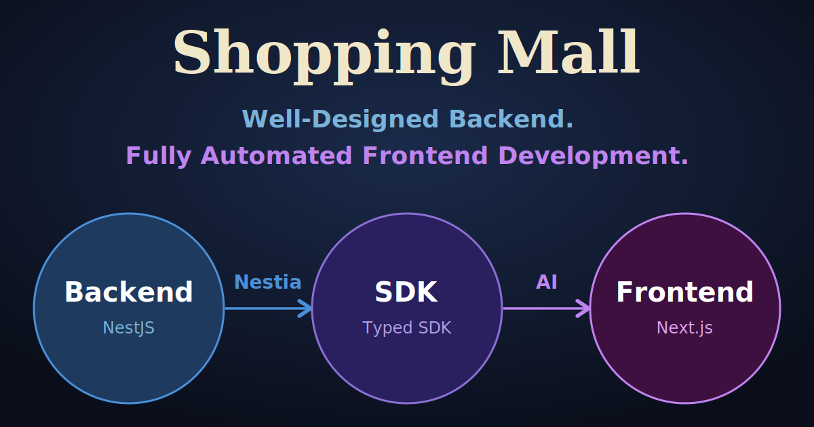

[](https://github.com/samchon/shopping/blob/master/LICENSE)
[](https://www.npmjs.com/package/@samchon/shopping-api)
[](https://github.com/samchon/shopping/actions/workflows/build.yml)

## 1. Prologue

> [Detailed Article](https://dev.to/samchon/nestia-well-designed-backend-fully-automated-frontend-development-45d9)

Well-designed backend + Nestia-generated SDK = AI automates the frontend.

This repository proves the point: with a Nestia-generated SDK and a single prompt ([`CLAUDE.md`](packages/frontend/CLAUDE.md)), a well-designed backend was enough to produce an enterprise-scale shopping mall frontend in one shot.

- **SDK**: collection of DTO types, typed fetch functions, and a mockup simulator
- [Nestia](https://nestia.io): SDK generator for NestJS
- [Nestia Editor](https://nestia.io/docs/swagger/editor): SDK generator from Swagger/OpenAPI

## 2. Demonstration

Customer, seller, and administrator — all three surfaces came out of a single prompt.

### 2.1. Customer

| Customer Home<br><sub>Catalog</sub> | Product Page<br><sub>Options and purchase flow</sub> |
|------|---------------|
| 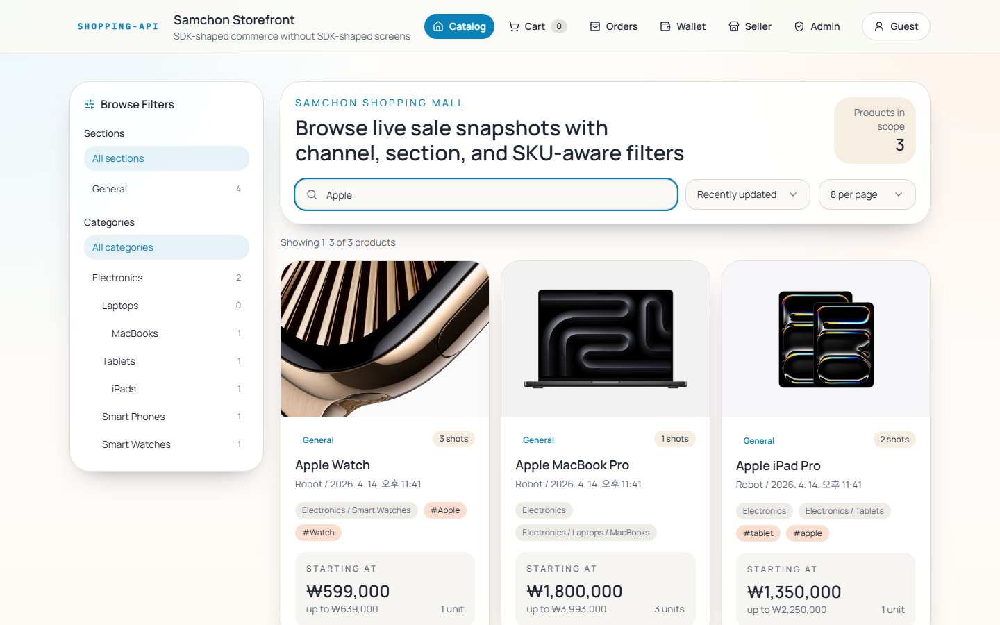 |  |

| Cart<br><sub>Draft checkout</sub> | Orders<br><sub>Order timeline</sub> |
|------|--------|
| 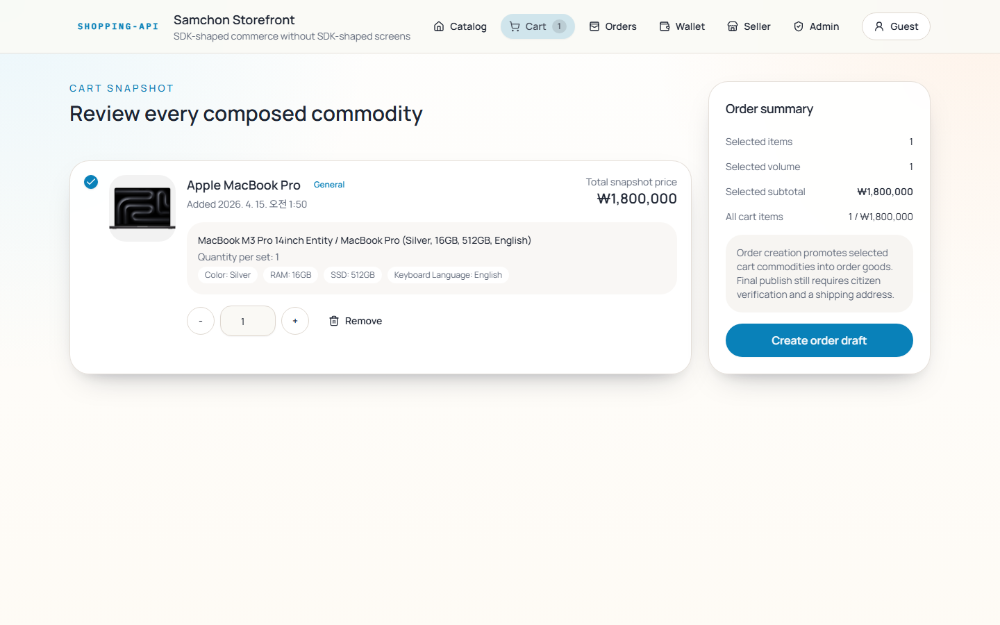 | 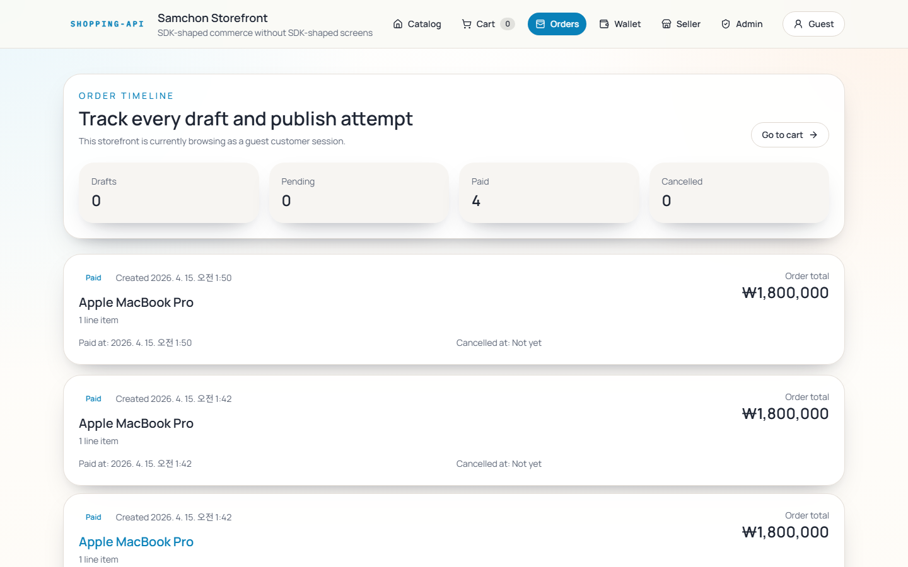 |

| Checkout<br><sub>Pricing and publish step</sub> | Wallet<br><sub>Balances and coupons</sub> |
|--------------|--------|
|  |  |

| Delivery<br><sub>Shipping state</sub> | Wallet History<br><sub>Deposit and mileage activity</sub> |
|-------------------|-----------------|
| 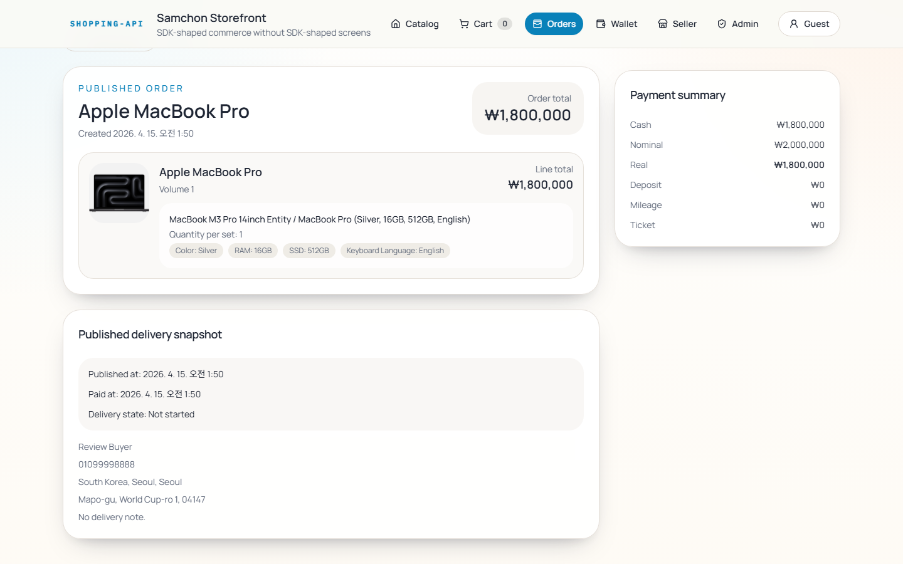 | 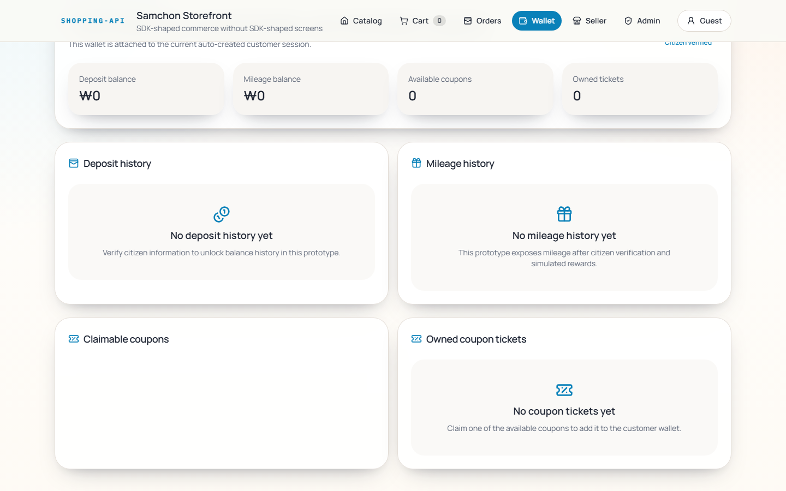 |

| Coupon Tickets<br><sub>Claimed discounts</sub> | Orders Feed<br><sub>Purchase history and states</sub> |
|---------------|-------------|
|  |  |

### 2.2. Seller

| Seller Console<br><sub>Revenue, sales, paid orders</sub> | Sale Studio<br><sub>Replicate a sale</sub> |
|---------|--------|
| 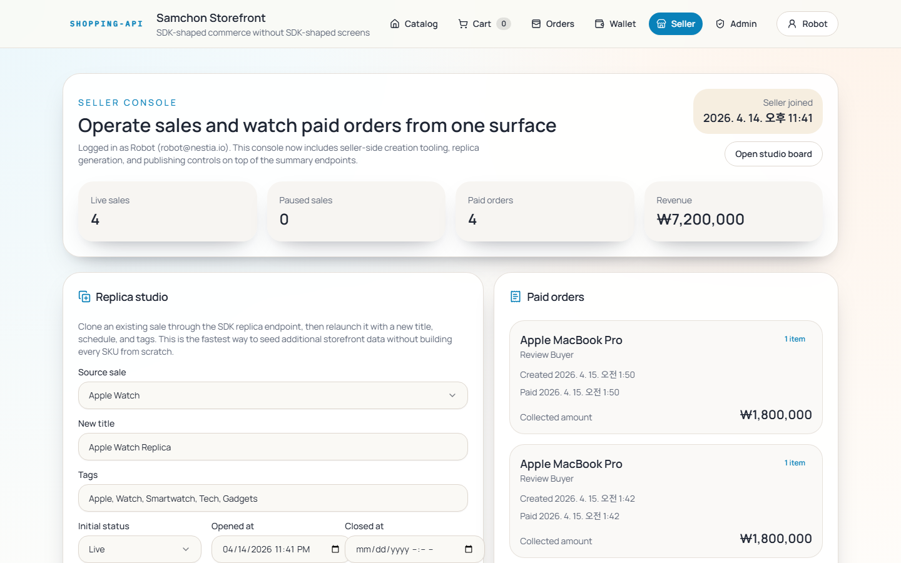 | 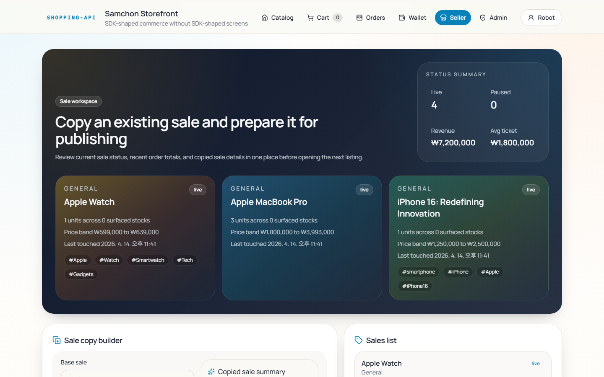 |

| Paid Orders<br><sub>Recent buyers and totals</sub> | Sales Board<br><sub>Live and paused inventory</sub> |
|-------------|-------------|
| 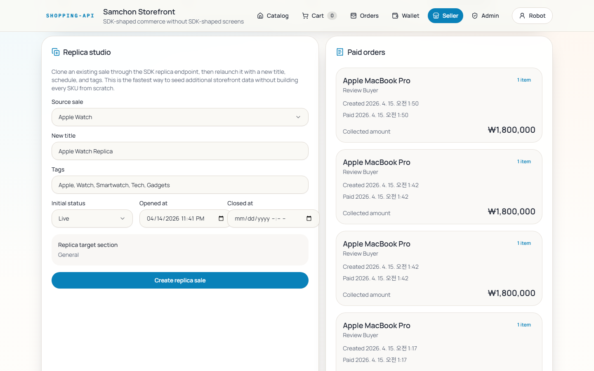 | 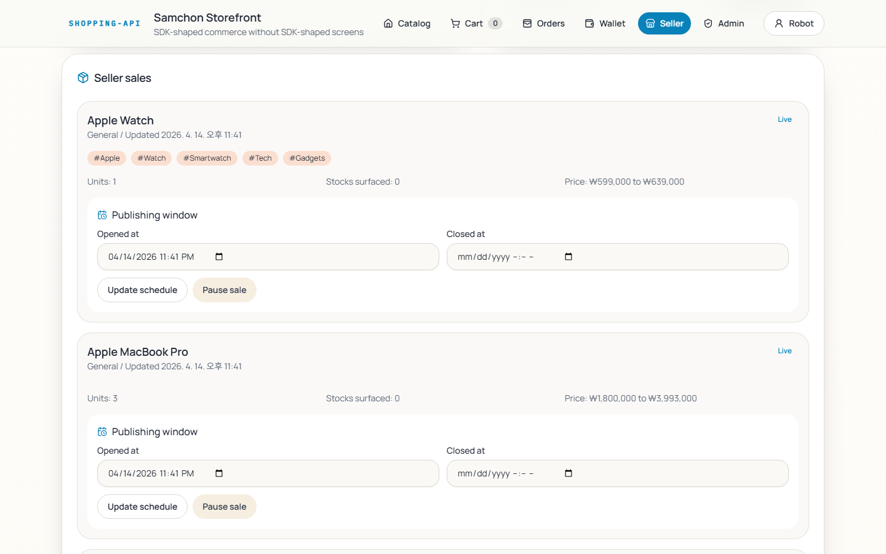 |

### 2.3. Administrator

| Admin Console<br><sub>Sales, revenue, coupons</sub> | Policy Board<br><sub>Commerce rules</sub> |
|---------|----------|
| 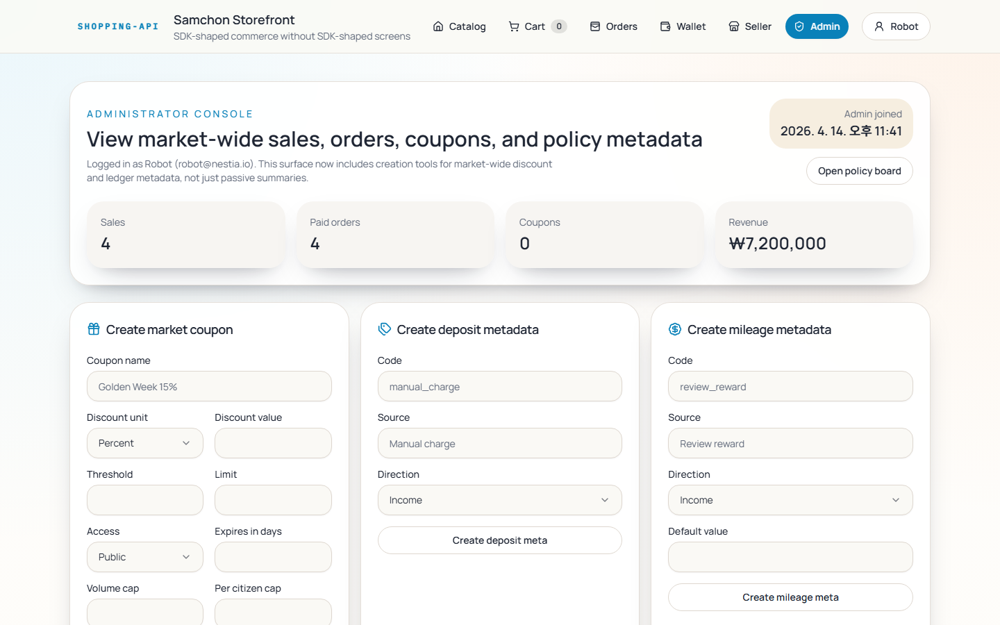 | 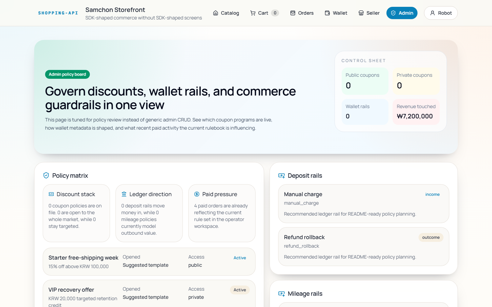 |

| Governance<br><sub>Coupon policy overview</sub> | Ledger Rails<br><sub>Deposit and mileage metadata</sub> |
|-------------------|--------------|
| 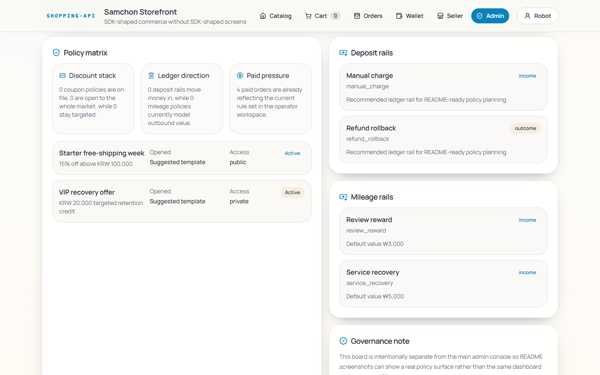 |  |

### 2.4. Try It

```bash
git clone https://github.com/samchon/shopping
cd shopping
docker compose up --build
```

| Service | Address |
|---------|---------|
| Frontend | http://127.0.0.1:3000 |
| Backend | http://127.0.0.1:37001 |

For manual setup without Docker: [Backend](packages/backend/) · [Frontend](packages/frontend/)

## 3. Why It Works

When every DTO and controller carries explicit types and documentation, a generated SDK becomes more than a developer convenience — it is a **harness** that lets AI read, build, and verify against the backend.

| Role | What | How |
|------|------|-----|
| **Context** | DTO types + JSDoc comments | AI reads the entire backend surface from code alone |
| **Constraint** | TypeScript type system | Wrong field or shape → type error → immediate correction |
| **Verification** | Mockup Simulator | AI tests its own code without a live server |

These three close a loop: **read the SDK → write frontend code → verify with the simulator → repeat.**

That is why the prompt ([`CLAUDE.md`](packages/frontend/CLAUDE.md)) could stay small. The SDK already carries the context. The prompt only sets priorities and workflow.

> For a deeper walkthrough with code examples, see the [Blog Article](https://dev.to/samchon/nestia-well-designed-backend-fully-automated-frontend-development-45d9).

## 4. Packages

| Package | Description |
|---------|------------|
| [`packages/api`](packages/api) | SDK auto-generated from the backend by Nestia |
| [`packages/backend`](packages/backend) | NestJS + Fastify backend with PostgreSQL and Prisma |
| [`packages/frontend`](packages/frontend) | Next.js storefront, built entirely by AI |


> [ERD and its documentation](packages/backend/docs/ERD.md)

## 5. AutoBe


> Even small models like `qwen3.5-35b-a3b` can hit 100%.

AutoBe is an open-source project that generates complete backends from natural-language requirements.

It produces robust API design and documentation. If you want to automate the backend as well, this is the best next step.

- [AutoBe Repository](https://github.com/wrtnlabs/autobe)
